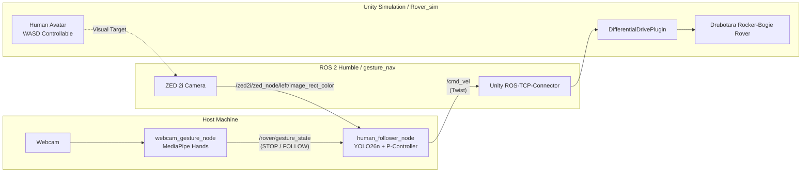

# gesture_nav: Rover Gesture & Human Following Navigation

An end-to-end vision-guided human tracking and hand-gesture teleoperation system for the **Drubotara Rocker-Bogie Rover** in Unity and ROS 2 Humble.

---

## Architecture Overview



---

## 1. Unity Controls & Entity Switching

Open your Unity project at `/home/masuk/Rover_sim`. In the top menu or using hotkeys:

* **`F1`**: Switch to **Old Rover** (`drubotara`).
* **`F2`**: Switch to **New Rocker-Bogie Rover** (`drubotara_skid`).
* **`F4`**: Switch to **Human Avatar** (`HumanAvatar`).
  * Instantiates the rigged humanoid avatar with `HumanAvatarController` 3.5m in front of the rover.
  * Disables manual keyboard driving on the rover while keeping its **ZED 2i sensors and `/cmd_vel` motor listeners running**.
  * Retargets Cinemachine (`Cam2`) and `ThirdPersonCamera` to follow behind the Human.
  * Use **WASD** to walk around the terrain; hold **Left Shift** or **Space** to sprint.
* **`F3`**: Toggle cycle: **Old Rover $\rightarrow$ New Rover $\rightarrow$ Human Avatar $\rightarrow$ Old Rover**.

---

## 2. Launching the ROS 2 Stack

All nodes use the dedicated isolated virtual environment at `/home/masuk/gesture_nav_venv` (configured with `numpy 1.26.4`, `mediapipe 0.10.14`, `ultralytics 8.4.165`, and ROS 2 Humble `cv_bridge`).

### Option A: Launch Everything with One Command
```bash
cd ~/gesture_nav
./run_all.sh
```

### Option B: Run Nodes Individually (Separate Terminals)

**Terminal 1 — Webcam Gesture Node:**
```bash
source /opt/ros/humble/setup.bash
source ~/gesture_nav_venv/bin/activate
source ~/gesture_nav/install/setup.bash
ros2 run gesture_nav webcam_gesture_node
```
* **Open palm (all fingers extended):** Publishes `STOP`.
* **Fist (all fingers folded):** Publishes `FOLLOW`.
* Displays a live OpenCV preview with debounced state and finger count.

**Terminal 2 — YOLO Human Follower Node:**
```bash
source /opt/ros/humble/setup.bash
source ~/gesture_nav_venv/bin/activate
source ~/gesture_nav/install/setup.bash
ros2 run gesture_nav human_follower_node --ros-args -p target_distance_m:=3.0
```
* Continuously processes ZED 2i images from `/zed2i/zed_node/left/image_rect_color`.
* Runs `yolo26n.pt` detection.
* Computes real-time distance and bearing error.
* Publishes `/cmd_vel` to maintain a 3.0 m standoff distance when in `FOLLOW` mode.

---

## 3. Edge Cases & Failure Modes

1. **Camera Border Truncation (Distance Overestimation):**
   * *Mechanism:* Distance is computed geometrically as $Z = \frac{f_y \cdot H}{h_{\text{pixels}}}$. If the human walks partially out of the camera's vertical field of view (e.g. stepping close so feet or head leave the frame), the bounding box height shrinks, which can falsely cause the rover to perceive the target as farther away.
   * *Mitigation:* The controller clamps maximum linear speed to $1.2\text{ m/s}$ and deadbands $0.25\text{ m}$ around the target distance.
2. **Target Occlusion / Out-of-Frame Loss:**
   * *Mechanism:* If the human rounds a sharp boulder or moves outside the camera FOV while in `FOLLOW` mode, YOLO loses detection.
   * *Behavior:* The follower node immediately sends zero velocity (`cmd_vel.linear.x = 0`, `cmd_vel.angular.z = 0`), halting the rover in place until the human re-enters the frame.
3. **Webcam Lighting / Partial Hand Transitions:**
   * *Mechanism:* Flickering between `STOP` and `FOLLOW` while clenching or opening the hand.
   * *Mitigation:* A 6-frame temporal debounce filter requires consistent state confirmation before publishing a mode transition over ROS.
